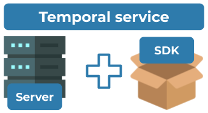
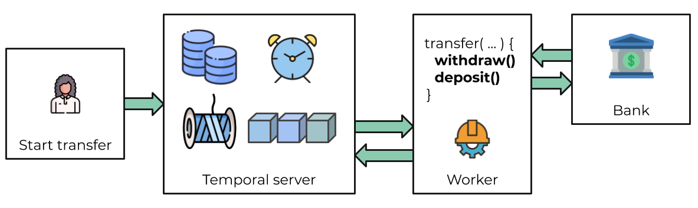
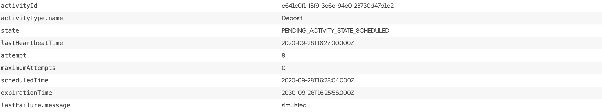

欢迎见证应用程序开发的进化！

这是针对初次上手[ Temporal ](https://docs.Temporal.io/docs/overview)并且具有一定的Go基本知识的开发人员的教程。我们建议您预留约20分钟的时间来完成它。通过阅读本教程，您将获取以下内容：

- 使用  Temporal  服务和[Go SDK](https://github.com/Temporalio/go-sdk)完成一些 Temporal Workflow 应用程序的运行。
- 练习访问和使用工作流状态的可视化。
- 了解工作流功能内建的可靠性。
- 了解  Temporal  的许多核心术语和概念。

 Temporal  服务和相应的SDK为现代应用程序开发产生的复杂性提供了全面的解决方案。



 Temporal  可以被视为一种方法，可以“治愈一切”你在作为开发者开发有依赖的应用程序时所面临的痛苦。 Temporal  提供开箱即用的可靠性原语，例如无缝和容错的应用程序状态跟踪，自动重试，超时，由于过程故障导致的回滚等等。

让我们运行我们的第一个  Temporal  工作流应用程序，并永远改变您处理应用程序开发的方式。您也可以通过我们的视频介绍来跟进：

[](https://www.youtube.com/embed/aUUhFAupUbk "")

##  &nbsp;项目设置

在开始之前，请确保您已阅读本教程的[准备条件](https://docs.Temporal.io/docs/go-sdk-tutorial-prerequisites)。

本教程使用一个完全正常工作的模板应用程序。您可以通过以下方式获得 [Go 项目模板](https://github.com/Temporalio/money-transfer-project-template-go)：以 [zip 格式](https://github.com/Temporalio/money-transfer-project-template-go/archive/main.zip)下载它，或者在自己的 Github 帐户中[创建一个新的存储库](https://docs.github.com/en/github/creating-cloning-and-archiving-repositories/creating-a-repository-from-a-template#creating-a-repository-from-a-template)，然后将存储库克隆到您选择的位置。查找“使用此模板”按钮：

请确保在自己的 Github 帐户中使用相同的存储库名称，以便在克隆时无需对 Go 模块名称进行更改。完成后在项目的根目录中打开终端。准备就绪。

##  &nbsp;应用概述

该项目模板模仿了“汇款”应用程序，为您提供了开始构建自己的应用程序并了解  Temporal  开箱即用的某些特性所需的最少元素。该项目包括一个预定义的[工作流函数](https://docs.Temporal.io/docs/workflows)，该[函数](https://docs.Temporal.io/docs/workflows)调用了`Withdraw()`和`Deposit()`函数的执行，表示从一个帐户到另一个帐户的资金转移。 Temporal  称此类函数为[Activity函数](https://docs.Temporal.io/docs/activities)。

要运行该应用程序，您将执行以下操作：

1. 向  Temporal  服务发送信号以开始转账。 Temporal  服务将跟踪您的工作流函数执行的进度。
2. 运行一个  Worker 。 Worker  是您已编译的 Workflow 和 Activity 代码的包装器。 Worker  唯一的工作就是执行“活动”和“工作流”函数，并将结果传达回 Temporal  服务。

这是对流程的高度抽象的图例说明：



### 工作流函数

当您“启动”工作流时，您基本上是在告诉 Temporal 服务“使用此签名来跟踪工作流的状态”。 Worker 将逐步执行下面的工作流代码，并将执行事件和结果传递回服务。

``` go
func TransferMoney(ctx workflow.Context, transferDetails TransferDetails) error {
    // RetryPolicy specifies how to automatically handle retries if an Activity fails.
    retrypolicy := & Temporal .RetryPolicy{
        InitialInterval:    time.Second,
        BackoffCoefficient: 2.0,
        MaximumInterval:    time.Minute,
        MaximumAttempts:    500,
    }
    options := workflow.ActivityOptions{
        // Timeout options specify when to automatically timeout Actvitivy functions.
        StartToCloseTimeout: time.Minute,
        // Optionally provide a customized RetryPolicy.
        //  Temporal  retries failures by default, this is just an example.
        RetryPolicy: retrypolicy,
    }
    ctx = workflow.WithActivityOptions(ctx, options)
    err := workflow.ExecuteActivity(ctx, Withdraw, transferDetails).Get(ctx, nil)
    if err != nil {
        return err
    }
    err = workflow.ExecuteActivity(ctx, Deposit, transferDetails).Get(ctx, nil)
    if err != nil {
        return err
    }
    return nil
}
```

### 传递初始化

要启动信息传输，我们需要告知服务我们要执行此工作流代码。确保[ Temporal 服务](https://docs.Temporal.io/docs/install- Temporal -server)在终端中运行，然后从项目根目录运行以下命令：

```
go run start/main.go
```

可以通过SDK或[CLI](https://docs.Temporal.io/docs/tctl)两种方法来通过  Temporal  启动工作流。在本教程中，我们使用SDK来启动工作流，这是在大多数生产环境中启动工作流的方式。这是我们刚刚执行此操作的代码：

``` go
func main() {
    // Create the client object just once per process
    c, err := client.NewClient(client.Options{})
    if err != nil {
        log.Fatalln("unable to create  Temporal  client", err)
    }
    defer c.Close()
    options := client.StartWorkflowOptions{
        ID:        "transfer-money-workflow",
        TaskQueue: app.TransferMoneyTaskQueue,
    }
    transferDetails := app.TransferDetails{
        Amount:      54.99,
        FromAccount: "001-001",
        ToAccount:   "002-002",
        ReferenceID: uuid.New().String(),
    }
    we, err := c.ExecuteWorkflow(context.Background(), options, app.TransferMoney, transferDetails)
    if err != nil {
        log.Fatalln("error starting TransferMoney workflow", err)
    }
    printResults(transferDetails, we.GetID(), we.GetRunID())
}
```

对 Temporal 服务的调用可以同步或异步完成。在这里我们异步执行此操作，因此您将看到程序正在运行并告诉您事务正在处理，然后退出。

### 状态可视化

好的，现在是时候看一下 Temporal 提供的最酷的特性之一：应用程序状态可视化。访问[ Temporal Web UI](localhost:8088)，您将在其中看到您的工作流。

接下来，单击您的工作流“Run Id”。现在，我们可以了解到让服务跟踪的工作流代码执行情况的所有信息，例如给出的参数值，超时配置，计划的重试次数，尝试次数，可跟踪堆栈错误等。

看起来我们的工作流正在“running”，但是为什么尚未执行工作流和活动代码？通过单击“Task Queue”名称，可以查看为处理这些任务注册的活动的“轮询者”。该列表将为空。没有在轮询任务队列！

[](https://www.youtube.com/embed/oUGf2D4kX3U "")

###  Worker 

 Worker 负责执行工作流和活动代码段，并且它从监听的任务队列中获取要从任务执行的代码段。 Worker 执行代码后，它将结果返回到 Temporal 服务。这是我们的 Worker 的样子：

``` go
func main() {
    // Create the client object just once per process
    c, err := client.NewClient(client.Options{})
    if err != nil {
        log.Fatalln("unable to create  Temporal  client", err)
    }
    defer c.Close()
    // This  Worker  hosts both  Worker  and Activity functions
    w :=  Worker .New(c, app.TransferMoneyTaskQueue,  Worker .Options{})
    w.RegisterWorkflow(app.TransferMoney)
    w.RegisterActivity(app.Withdraw)
    w.RegisterActivity(app.Deposit)
    // Start listening to the Task Queue
    err = w.Run( Worker .InterruptCh())
    if err != nil {
        log.Fatalln("unable to start  Worker ", err)
    }
}
```

请注意， Worker 侦听了发送工作流和活动任务的同一任务队列。这称为“任务路由”，是用于负载均衡的内置机制。

``` go
const TransferMoneyTaskQueue = "TRANSFER_MONEY_TASK_QUEUE"
```

是时候开始启动 Worker 了。从项目根目录运行以下命令：

```
go run  Worker /main.go
```

当启动 Worker 时，它将开始轮询任务队列。 Worker 找到的第一个任务是告诉它执行工作流函数的任务。 Worker 将事件传达回服务，随后服务也将“活动任务”发送到“任务队列”。然后， Worker 从任务队列中按各自的顺序抓取每个活动任务，并执行每个相应的活动。


**恭喜**，您刚刚运行了 Temporal  Workflow应用程序！

##  &nbsp;故障模拟

您只是体验到了 Temporal 令人惊讶的特性之一：对工作流的可视化以及执行代码的 Worker 的状态。让我们探索另一个关键特性，即使遇到失败也能保持工作流的状态。为了证明这一点，我们将模拟工作流的一些失败。在继续操作之前，请确保您的 Worker 已停止。

### 服务崩溃

与许多需要复杂的领导者选举流程和外部数据库来处理故障的现代应用程序不同，即使服务关闭 Temporal 也会自动保留工作流的状态。您可以按照以下步骤轻松地对此进行测试（同样，请确保您的 Worker 已停止，保证您的工作流不会完成）：

1. 再次启动工作流。
2. 验证工作流在 UI 中是否是在运行。
3. 使用'Ctrl c'或通过 Docker 仪表板关闭 Temporal 服务。
4.  Temporal 服务停止后，重新启动它并访问 UI。

您的工作流仍然在那里！

### 活动错误

接下来，让我们模拟`Deposit()`活动函数中的错误。让您的工作流继续运行。打开 activity.go 文件，并关闭 return 语句上的注释，以使该`Deposit()`函数返回错误：

``` go
func Deposit(ctx context.Context, transferDetails TransferDetails) error {
    fmt.Printf(
        "\nDepositing $%f into account %s. ReferenceId: %s\n",
        transferDetails.Amount,
        transferDetails.ToAccount,
        transferDetails.ReferenceID,
    )
    // Switch out comments on the return statements to simulate an error
    //return fmt.Errorf("deposit did not occur due to an issue")
    return nil
}
```

保存并运行 Worker 。 Worker 完成了`Withdraw()`活动函数，但是在尝试`Deposit()`活动函数时抛出了错误。请注意， Worker 如何继续重试该`Deposit()`函数？要查看正在发生的信息，请访问 UI 并单击工作流的RunId。您将在此处看到挂起的活动，其中包括其状态、已尝试的次数以及下一次计划的尝试的详细信息。



传统上，应用程序开发人员被迫在业务代码本身内实现超时和重试逻辑。而 Temporal 的关键特性之一是在工作流代码中将[超时配置](https://docs.Temporal.io/docs/activities/#timeouts)和[重试策略](https://docs.Temporal.io/docs/activities/#retries)指定为“活动”选项。在工作流代码中，您可以看到我们为活动指定了 StartToCloseTimeout，并设置了重试策略，告诉服务最多重试500次。但是我们仍以本教程为例对此进行了说明，因为如果未指定默认值， Temporal 会自动使用默认重试策略！

因此，您的工作流正在运行，但是只有“`Withdraw()`活动”函数已成功。在任何其他应用程序中，整个过程可能必须被放弃并回滚。因此，这是本教程的最后一个特性：使用 Temporal ，我们可以在工作流运行时调试问题！假设您找到了可能解决该问题的方法：在 activity.go 文件中的`Deposit()`函数的 return 语句上切换注释，并保存您的更改。我们如何更新已经完成一半的工作流？在 Temporal 里实际上非常简单：只需重新启动 Worker ！

在下一次计划的重试中， Worker 将在工作流失败的地方继续工作，并成功执行新编译的`Deposit()`活动函数，从而完成工作流。基本上您只是“实时”地修复了一个错误，而不会丢失工作流的状态。


##  &nbsp;回顾检查

做得好！现在，您知道如何运行 Temporal 工作流并了解 Temporal 提供的一些关键特性。让我们进行快速回顾，以确保您记得一些更重要的部分。

 &nbsp;**我们在本教程中谈到的 Temporal 的四个特性是什么?**

1.  Temporal 使您可以完全了解工作流和代码执行的状态。
2. 即使服务中断或错误， Temporal 仍可以保持工作流的状态。
3. 借助 Temporal ，可以使用业务逻辑外的选项轻松地超时和重试活动代码。
4. 使用 Temporal ，您可以在工作流运行时执行业务逻辑的“实时调试”。

 &nbsp;**如何将工作流启动与执行它的  Worker  配对?**

使用相同的 Task Queue.

 &nbsp;**如果我们更改正在运行的工作流的“活动”代码，该怎么办?**

重新启动  Worker .
